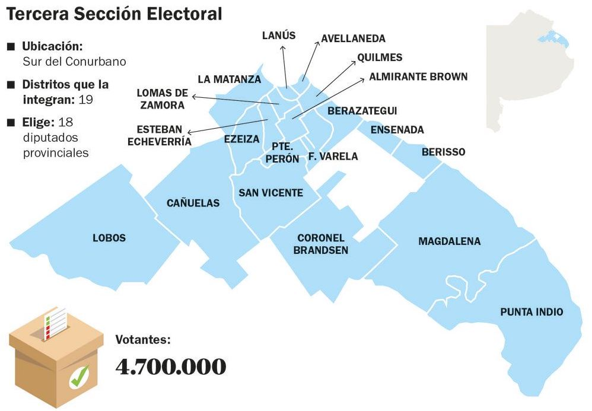

<style>
body {font-family:helvetica;
line-height: 1.5;
  font-size: 12pt;
text-align: justify}
</style>


<center>

{width=70%}
</center>

```{r setup, include=FALSE}
knitr::opts_chunk$set(echo = TRUE)
```

## Inicio

El presente documento electrónico es un **ejercicio abierto** de extracción, sistematización y visualización de los resultados del recuento provisional de las Elecciones Primarias, Abiertas, Simultaneas y Obligatorias en Argentina (PASO 2021). 

Tanto la presentación de los datos como la síntesis del abordaje son una elaboración original, especialmente desarrollada para el encuentro __Cómo empezar?__ de [R-Ladies](https://twitter.com/RLadiesBA) y [NIS](https://www.nucleodeinnovacion.com/).  


## Nuestra Consulta

Para consultar los datos de las PASO debemos acceder al portal del Estado Nacional donde se encuentra publicado el recuento provisorio: https://www.argentina.gob.ar/elecciones/resultados-del-recuento-provisional-de-las-elecciones-paso. Aquí encontraremos los resultados de las elecciones por provincia (y sección para el caso de Buenos Aires).

En esta oportunidad nos invito a conocer cuáles fueron los resultados de las elecciones PASO a concejal en mi ciudad: Lanús, Provincia de Buenos Aires, correspondiente a la tercera sección electoral.

$~$

<center>

{width=70%}
</center>

$~$

Es importante destacar que a los fines expositivos de este documento no vamos a descargar los datos localmente, sino que los consultaremos de manera remota conectándonos mediante el siguiente enlace: https://argentina.gob.ar/sites/default/files/buenos_aires_tercera.zip . Este proceso lo retomaremos a continuación.

## Hands on Lanús

Primero y principal vamos a levantar las librerías que utilizaremos para nuestra consulta:

```{r librerías, echo = T, message=FALSE, warning=FALSE}
library(data.table) # nos interesa la función fread para levantar el CSV
library(tidyverse) #un clásico
library(stringr) # para limpiar y acomodar el dataframe
library(ggplot2) # (L)
library(artyfarty) # para customizar los gglots

```

Como lo planteáramos anteriormente, vamos a descargar el set de datos de los votos correspondiente a la tercera sección electoral de la provincia de Buenos Aires. Lo que observaremos inicialmente es que el enlace nos remite a un archivo comprimido zip. Resolvemos la descarga con el siguiente código:

```{r decarga de datos, echo = T, message=FALSE, warning=FALSE, out.width = '100%'}

activity_url <- "https://argentina.gob.ar/sites/default/files/buenos_aires_tercera.zip" 
#Recordemos que este era el link que nos interesaba

temp <- tempfile()

download.file(activity_url, temp)

unzip(temp, "Buenos Aires_Tercera.csv") #lo descarga en nuestro proyecto

ba_tercera <- fread("~/Investigaciones/paso2021/Buenos Aires_Tercera.csv", sep=";")

unlink(temp)
```

Al checkear nuestros datos nos encontraremos con más de un millón de observaciones y 19 variables correspondiente a los resultados de las PASO por municipio (de la tercera sección), lista en pugna, agrupaciones y escuelas donde votaron lxs ciudadanxs.

```{r check, echo = T, message=FALSE, warning=FALSE, results=F}
summary(ba_tercera)
```

Ahora que verificamos que nuestros datos iniciales están ok, haremos una síntesis que de cuenta del panorama de votos para la categoría concejales en Lanús. 

Nos interesa generar un cuadro de 6 columnas que recoja los votos totales y porcentuales por agrupación (partidos) y lista (subcategorías dentro de las agrupaciones), con ambos registros podemos aproximarnos un panorama descriptivo de las elecciones en el municipio.

Para ello, una estrategia, de muchas posibles, es armar dos cuadros que después uniremos para obtener los datos tal como los queremos.

```{r procesamiento1, echo = T, message=FALSE, warning=FALSE, out.width = '100%'}

lanus_listas <- ba_tercera%>%
  filter(Cargo=="CONCEJALES") %>% #filtra concejales
  filter(Seccion=="Lanús") %>%  #filtra para lanus
  select(Agrupacion, lista, tipoVoto, votos) %>% #seleccion de variables
  mutate(tipo_voto = case_when(tipoVoto %in% "blancos" ~ "blancos",
                      tipoVoto %in% c("nulos", "recurridos",
                      "impugnados", "comando") ~ "nulos", 
                      tipoVoto %in% "positivo" ~ "positivo"))%>% 
  group_by(Agrupacion, lista, tipo_voto) %>%
  summarise(votos_lista=sum(votos)) %>% #dato de votos por lista 
  mutate(across(where(is.character), 
        str_remove_all, pattern = fixed("positivo")))  
```

Acomodamos el df para organizar los datos por lista y agrupación

```{r procesamiento2, echo = T, message=FALSE, warning=FALSE, out.width = '100%'}

lanus_listas$listas <- paste(lanus_listas$lista, lanus_listas$tipo_voto)

lanus_listas$agrupaciones <- paste(lanus_listas$Agrupacion, lanus_listas$tipo_voto)

# N y % votos por agrupación
lanus_agrupaciones <- lanus_listas%>%
  group_by(agrupaciones) %>% 
  summarise(votos_agrupacion=sum(votos_lista)) %>% 
  mutate(totales=sum(votos_agrupacion),
         porc_agrupacion=1e2*votos_agrupacion/totales)

# complementa % votos por lista y arma el df final
lanus_concejales <- lanus_listas %>% 
  left_join(lanus_agrupaciones, by="agrupaciones") %>%
  mutate(porc_lista=1e2*votos_lista/votos_agrupacion) %>%
  ungroup() %>% 
  select(agrupaciones, listas, votos_agrupacion,
         votos_lista, porc_agrupacion, porc_lista)
```

**Lo logramos!** Para finalizar vamos a graficar nuestro trabajo destacando la performance electoral de las fuerzas políticas más votadas en el municipio. 

Primero imprimiremos el porcentual de votos por agrupación:

```{r plot agrupaciones, echo = T, message=FALSE, warning=FALSE, out.width = '100%'}

p <- lanus_concejales%>%
  select(agrupaciones, porc_agrupacion) %>% 
  distinct()%>%
  filter(porc_agrupacion>1) %>% 
  arrange(porc_agrupacion) %>% 
  mutate(agrupaciones= fct_recode(agrupaciones,
                                  "FIT"= "FRENTE DE IZQUIERDA Y DE TRABAJADORES - UNIDAD "))%>%
  mutate_if(is.numeric, round, digits=1)%>%
  ggplot(aes(x = reorder(agrupaciones, +porc_agrupacion, sum), 
             y = porc_agrupacion, fill = agrupaciones)) +
  geom_bar(stat = "identity")+
  coord_flip()+
  geom_text(aes(label=porc_agrupacion), 
            position=position_dodge(width=0.1), vjust=-0.25,
            size = 2, lineheight=.7, margin=margin(-15,5,5,10))+
  ggtitle("PASO 2021 Lanús: Porcentaje de votos por agrupación política para la categoría concejal.") +
  labs(x= "Agrupación",
       y= "% votos por agrupación",
       fill = "Agrupaciones",
       caption = "Fuente: datos abiertos de la Dirección Nacional Electoral.")+
  theme(plot.title = element_text(hjust = 0.5, size = 9, 
                                  lineheight=.7, face="bold",
                                  margin=margin(15,15,15,15)),    
        axis.text.x = element_text(angle = 45, size = 5),
        axis.title.x = element_text(size = 7),
        axis.title.y = element_text(size = 7),
        axis.text.y = element_text(size = 7),
        plot.caption = element_text(hjust = 0, face = "italic", size = 6),
        legend.title = element_text(color = "black", size = 6),
        legend.text = element_text(color = "black", size = 5),
        legend.position="right")

p


```

$~$

Y luego consultaremos el porcentaje de votos por lista customizando ahora nuestro plot:

```{r plot listas, echo = T, message=FALSE, warning=FALSE, out.width = '100%'}

p <- lanus_concejales%>%
  filter(votos_agrupacion>12900) %>% 
  mutate(agrupaciones= fct_recode(agrupaciones,
      "FIT"= "FRENTE DE IZQUIERDA Y DE TRABAJADORES - UNIDAD "))%>%
  mutate_if(is.numeric, round, digits=1)%>%
  ggplot(aes(x = reorder(listas, +porc_lista, sum), 
             y = porc_lista, fill = agrupaciones)) +
  geom_bar(stat = "identity")+
  geom_text(aes(label=porc_lista), 
            position=position_dodge(width=0.1), vjust=-0.25,
            size = 2, lineheight=.7, margin=margin(-15,0,0,0))+
  ggtitle("PASO 2021 Lanús: Porcentaje de votos a concejal por lista, según agrupación política") +
  scale_fill_manual(values = pal("d3js"))+
  labs(x= "Listas",
       y= "% Votos por lista.",
       fill = "Agrupaciones",
       caption = "Fuente: datos abiertos de la Dirección Nacional Electoral.")+
  theme(plot.title = element_text(hjust = 0.5, size = 9, 
                              lineheight=.7, face="bold",
                              margin=margin(15,15,15,15)),    
    axis.text.x = element_text(angle = 45, size = 5,
                               margin=margin(-15,-15,-15,-15)),
    axis.title.x = element_text(size = 7, 
                                margin=margin(-15,-15,-15,-15)),
    axis.title.y = element_text(size = 7),
    axis.text.y = element_text(size = 7),
    plot.background=element_rect(fill = "#fefdf6"),
    panel.background = element_rect(fill = '#F0EDE3'),
    panel.grid.major = element_line(colour = "#b4d9cf"),
    strip.background = element_rect(fill="#b4d9cf"),
    plot.caption = element_text(hjust = 0, face = "italic", size = 6,
                                margin=margin(20,20,20,20)),
    legend.title = element_text(color = "black", size = 6),
    legend.text = element_text(color = "black", size = 5),
    legend.position="right")+
  facet_wrap(~agrupaciones, scales = "free", ncol = 3)

p
 
```

Hasta aquí la exposición del día! invito a que sigan ordenando los datos por las distintas categorías de la elección, prestando atención por ejemplo al caso de diputadxs nacionales, provinciales, como así también a la posibilidad de filtrar los resultados  por provincia, municipio, o escuela. 
